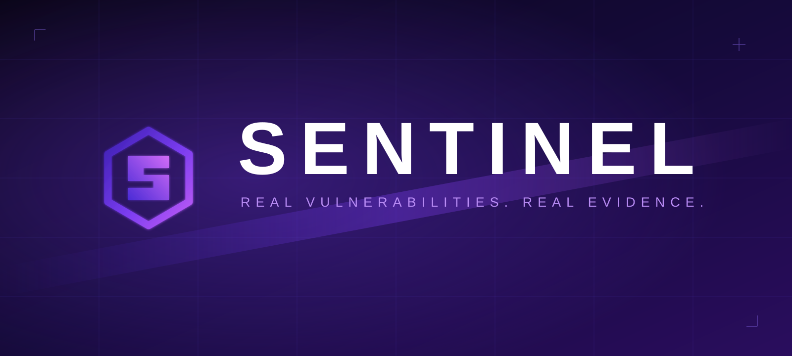

<div align="center">



### Real vulnerabilities. Real evidence.

**A production-grade web application security testing platform — written in Rust.**
Proxy · Repeater · Intruder · Scanner · Crawler · Decoder · Comparer · Sequencer · Verification · Reporting

[](https://www.rust-lang.org)
[](#benchmarks--precision)
[](#quick-start)
[](#license)

[Quick Start](#quick-start) • [Why Sentinel](#why-sentinel) • [Capabilities](#capabilities) • [Verification](#the-verification-gate) • [Architecture](#architecture) • [Benchmarks](#benchmarks--precision) • [Contributing](#contributing)

</div>

---

Sentinel is a security-testing workbench for professional assessment teams. It gives you the full
assessment lifecycle in one place — scope, discovery, interception, manual testing, fuzzing,
automated scanning, verification, evidence, findings, and reporting — and every stage produces real,
traceable data that flows into the next.

**It is built around one non-negotiable rule: no fake results.** A vulnerability is never reported
unless there is deterministic technical evidence that it exists. Anything weaker is classified as
`Informational`, `Potential`, or `Needs Manual Verification` — never inflated to make the tool look
more powerful.

> Sentinel is for **authorized security testing only**. Only test systems you own or have explicit
> written permission to assess.

---

## Quick Start

```bash
# Build and run the test suite
cargo build
cargo test

# Desktop application (Tauri + React UI)
npm install
npm run dev
```

The repository is a Rust workspace with two front ends:

- a **TUI** core (`src/`) — the full engine and every tool;
- a **desktop app** (`src-tauri/` + `ui/`) — a Tauri shell over the same engine.

---

## Why Sentinel

**Precision over quantity.** A scanner that reports 500 mostly-false findings is not successful.
Sentinel optimizes for precision, evidence, reproducibility, and confidence — not finding count.

**A real verification engine, not keyword matching.** Every finding carries a baseline, an observed
delta, a reason the delta is a security issue, confidence, evidence, and a reproduction. If Sentinel
cannot establish a vulnerability, it says so instead of guessing.

**One interconnected platform.** A request captured in the Proxy can move to Repeater, Intruder,
the Scanner, the Comparer, the Decoder, a finding, or the Organizer — the same HTTP message model is
shared everywhere.

**Scope is enforced, not suggested.** Every automated engine resolves the target against scope
*before* any network I/O. Out-of-scope mutations are skipped and counted — never silently sent.

---

## Capabilities

| Area | What it does |
|---|---|
| **Target & Scope** | Hosts, domains, URLs, ports, IPs; include/exclude rules; scope validation and enforcement across all engines |
| **Proxy / Intercept** | HTTP/1.1 + HTTPS interception, request/response inspection and modification, history, filtering, match/replace, raw/parsed views, WebSocket traffic |
| **Repeater** | Multi-tab manual request testing, editing, duplication, history, timing, status/length |
| **Intruder** | Payload positions, multiple insertion points, payload sets (list/wordlist/numeric/charset), encoders, Sniper/Pitchfork/ClusterBomb, bounded concurrency + rate limits + hard request cap + cancellation |
| **Scanner** | Modular passive + active engine: baseline → mutate → observe → compare → verify |
| **Crawler / Discovery** | Links, forms, endpoints, parameters, API routes, robots.txt, sitemaps, redirects, technologies; normalized site map with discovery provenance |
| **Decoder** | URL/base64/hex/HTML/unicode, JSON format/minify, JWT inspection, hash identification, transform chaining |
| **Comparer** | Line, header, and structural JSON diffs for requests, responses, and payload results |
| **Sequencer** | Statistical token analysis: Shannon entropy (per-char and per-position), distribution, repetition, sequential/prefix/suffix indicators — with methodology and confidence |
| **Verification** | Baseline → controlled test → compare → independent confirmation → false-positive controls → confidence → finding |
| **Findings & Evidence** | Severity, confidence, evidence quality, detection method, verification status, reproduction request, timestamp |
| **Reporting** | HTML / JSON / Markdown / PDF with title, severity, confidence, asset, endpoint, parameter, description, technical explanation, evidence, reproduction, impact, remediation, references, verification status |
| **Projects** | Scope, targets, requests, responses, findings, evidence, scanner config, notes, auth state, test history, reports — stop and resume |
| **Plugins / SDK** | Extend requests, responses, findings, scanners, transforms, and workflows with explicit permissions |
| **Protocols** | HTTP/2, HTTP/3, WebSocket, GraphQL, gRPC, JWT, OAuth |
| **Authenticated testing** | Sessions, cookies, headers, login workflows, session refresh, re-authentication, recorded logins |

---

## The Verification Gate

Sentinel's defining feature is that a *scanner result is not automatically a vulnerability*. Before a
finding is created, the engine asks:

1. What is the baseline?
2. What exactly changed?
3. Why does the change indicate a vulnerability?
4. Can it be reproduced?
5. Can it be independently verified?
6. Is there a plausible benign explanation?
7. What evidence supports the conclusion?
8. What is the confidence?
9. Can another tester reproduce it?

If the answer is not strong enough, the finding is **not confirmed**. It is recorded as `Potential`
or `Needs Manual Verification`, with the evidence attached so a human can decide.

Status values are kept strictly separate and never mixed:
`Confirmed` · `Detected` · `Potential` · `Informational` · `Needs Manual Verification`.

---

## Architecture

```
Scope → Recon → Discovery → Proxy → Traffic Analysis → Manual Testing (Repeater)
      → Fuzzing (Intruder) → Automated Scanning → Verification → Evidence
      → Findings → Organization → Reporting → Regression
```

The engine is organized as focused modules under `src/`, each with its own models, errors, events,
and tests — `proxy`, `intercept`, `repeater`, `intruder`, `scanner`, `crawler`, `sitemap`, `scope`,
`decoder`, `comparer`, `sequencer`, `findings`, `evidence`, `reporting`, `session`, `auth`, `plugins`,
`http2`, `http3`, `websocket`, `graphql`, `grpc`, `jwt`, `oauth`, and more.

---

## Benchmarks & Precision

Sentinel ships with a controlled local benchmark suite that measures **both** detection and
false-positive behaviour. Intentionally vulnerable fixtures must be detected; intentionally safe
fixtures must produce **zero** findings.

| Benchmark | What it enforces |
|---|---|
| `bench_security_headers` | Header findings only on served HTML 2xx documents; HSTS only over HTTPS; JSON APIs, redirects, error pages, and missing content-type yield nothing |
| `bench_xss` | Only verbatim, unescaped reflections of the injected payload count; HTML-escaped, partial, and keyword-only responses yield nothing |
| `bench_sqli` | Error-based requires a *new* error vs baseline; time-based requires absolute + relative delay; boolean/union require material directional change |
| `bench_sqli_e2e` | The real SQLi rule, run end-to-end through the pipeline against local vulnerable and safe servers |

Current status: **116 unit tests · 17 benchmark tests · 3 integration tests · 0 warnings.**

---

## Contributing

Contributions are welcome — new scanner rules, protocol support, transforms, plugin capabilities,
benchmark fixtures, and core improvements. Every new detection rule must come with tests proving it
finds the vulnerable case **and** stays silent on the safe case.

---

## Ethical Use

Sentinel is a tool for authorized security professionals. You are responsible for complying with all
applicable laws and for obtaining explicit permission before testing any system. Do not use Sentinel
against systems you do not own or have written authorization to test.

---

## License

Licensing is not yet finalized. Until a license is published, all rights are reserved by the
maintainers — contact them for commercial or redistribution terms.

<div align="center">


**Sentinel** — real vulnerabilities, real evidence.

</div>
